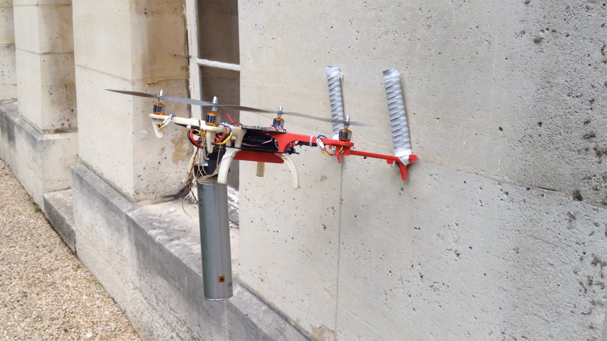
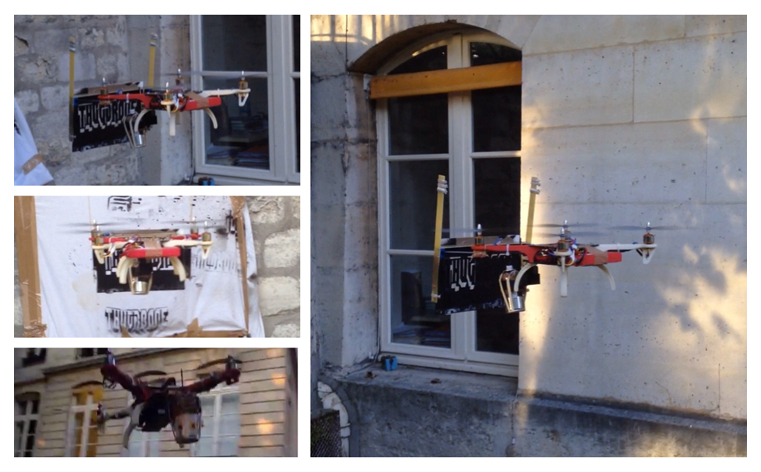

quadcopter
==========

In the beginning of 2014, [Hassan Bouchiba](http://www.mines-paristech.fr/Services/Annuaire/hassan-bouchiba) and I [Edouard Leurent](http://edouardleurent.com/) decided to make a quadcopter from scratch as a hobbyist robotics project.

# Parts

| Sensors   |  Actuators  |  Frame |
|-----------|-------------|--------|
| <ul><li>ITG-3200 MEMS gyroscope</li><li>ADXL345 accelerometer</li><li>HMC5883L magnetometer</li></ul> |  <ul><li>A2212-13 Brushless Motors</li><li>APC 10x4.7 Propellers</li><li>FlyFun Electronic Speed Controllers 18A</li> | <ul><li>Designed on Catia</li><li>3D printed arms</li><li>Core made of carbon plates</li> |
|  |  | See below |



  

# Media





# Application: the ThugDrone

Now that the drone was up and flying, my good friend [Adrien Rahier](http://adrienrahier.com) came to me with the idea to use it as an aerial graffiti platform.

We actuated a spray can with a servo-motor controlled remotely, and mounted it with a rotating joint on the quadcopter.




The drone had to be able to automatically stay still against a wall.



Here is the result.

